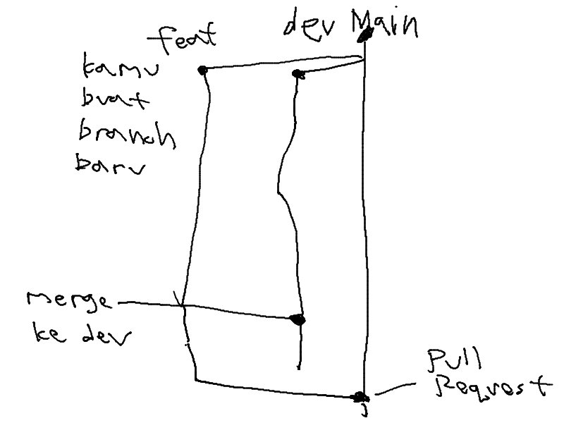

# ALL OF HOW TO's
## Table of Contents
- [How to Clone and Setup Repos](#how-to-clone-and-setup-repos)
    - [For SSH](#for-ssh)
    - [For HTTPS](#for-https)
- [What to Do After Getting a Task](#what-to-do-after-getting-a-task)

## How to Clone and Setup Repos
### For SSH

```
git clone git@github.com:effiecient/effie-FE.git
cd effie-FE
git remote set-url origin --push --add git@gitlab.informatika.org:if3250-k1-g1/effie-FE.git
git remote set-url origin --push --add git@github.com:effiecient/effie-FE.git
cd ..

git clone git@github.com:effiecient/effie-BE.git
cd Effie-BE
git remote set-url origin --push --add git@gitlab.informatika.org:if3250-k1-g1/effie-BE.git
git remote set-url origin --push --add git@github.com:effiecient/effie-BE.git
```

### For HTTPS

```
git clone https://github.com/effiecient/effie-FE.git
cd effie-FE
git remote set-url origin --push --add https://gitlab.informatika.org/if3250-k1-g1/effie-FE.git
git remote set-url origin --push --add https://github.com/effiecient/effie-FE.git
cd ..

git clone https://github.com/effiecient/effie-BE.git
cd Effie-BE
git remote set-url origin --push --add https://gitlab.informatika.org/if3250-k1-g1/effie-BE.git
git remote set-url origin --push --add https://github.com/effiecient/effie-BE.git
```

## What to Do After Getting a Task
1. Go to branch `main` and pull the latest changes with `git pull`.
2. Create a new branch with `git checkout -b <branch-name>`. (e.g. `git checkout -b feat/login`)
3. Setup your environment by creating an `.env` file. (See `.env.example` for reference)
4. Do your task.
5. Commit your changes with `git add .` and `git commit -m "<commit-message>"`.
6. Push your changes to the remote branch with `git push`.
7. Go to branch `dev` with command `git checkout dev` and pull the latest changes with `git pull`. Then, merge your branch and squash it with `git merge --squash <branch-name>`.
8. Push your changes to the remote branch with `git push`.
9. Create a pull request for your branch to `main` branch.

## Flow Visualization
